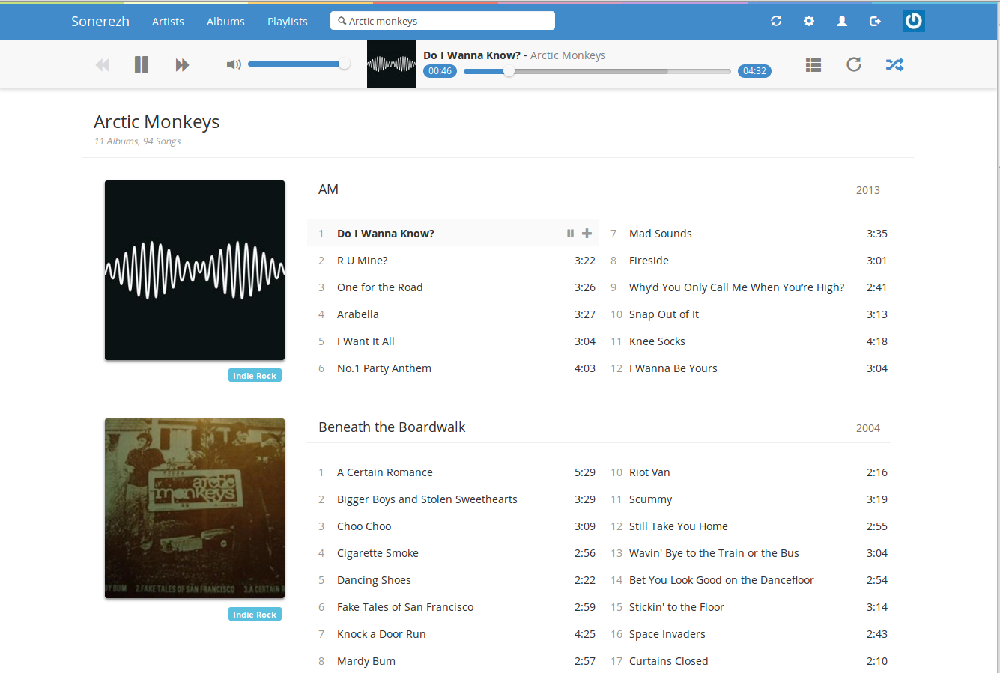
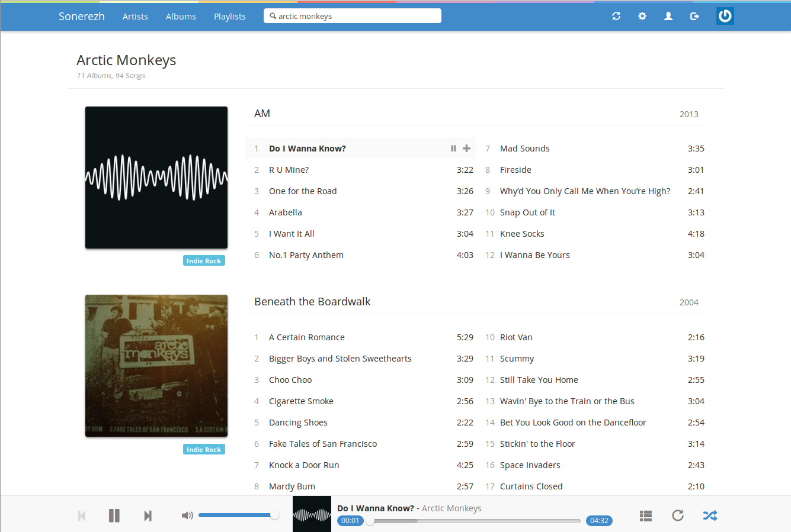
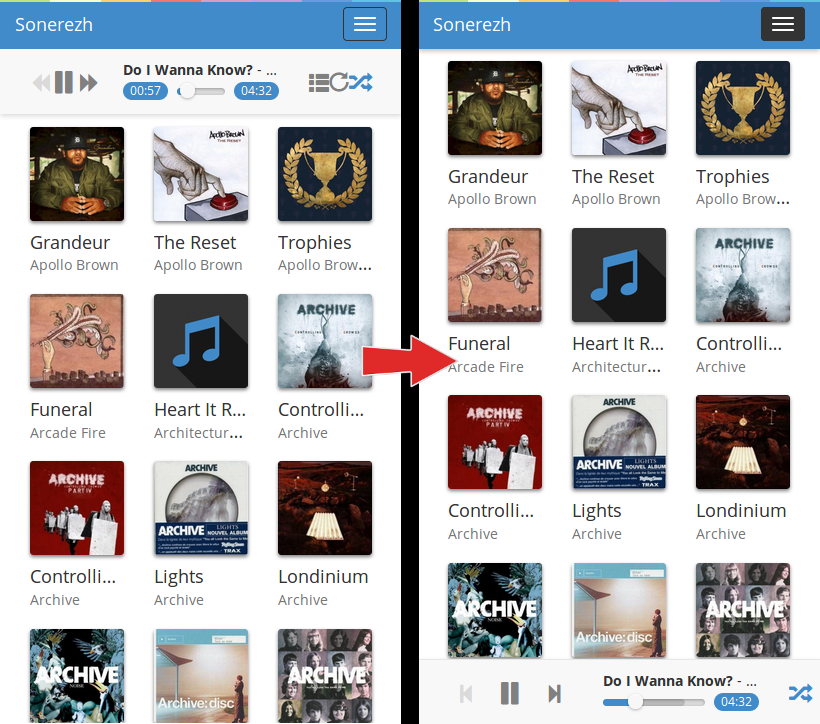
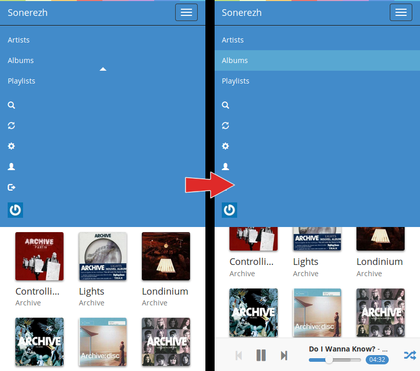

Sonerezh Mobile
===========
Some Sonerezh theme hacks for a better mobile experience :
- Navbar player on Bottom
- Next/Previous icon modification
- More space for the playing controls (play/next/previous)
- Navbar collapse fix
- Some controls are hidden

Tested on Firefox with Sonerezh v1.2.4

Preview
------------
Desktop:

Before:

After:

Mobile:

Installation
------------
-Make a backup of your Sonerezh "app" directory (e.g. /var/www/sonerezh/app) or only the following files :
    app/View/Layouts/default.ctp
    app/webroot/css/style.css
    app/webroot/js/navigation.js

-Download an unzip the project

-Copy "app" directory in your Sonerezh folder (e.g. /var/www/sonerezh/app)

Contact
------------
You can contact me at: string.Format("{0}#{1}","its.skway","gmail.com").Replace("#","@");

Donations are welcome:
- BTC: 174Eud8voesGp3YcpzjZJGjcjYAr2V42fH

Written by Skw4y in 2018. Released under the terms of the MIT License.
